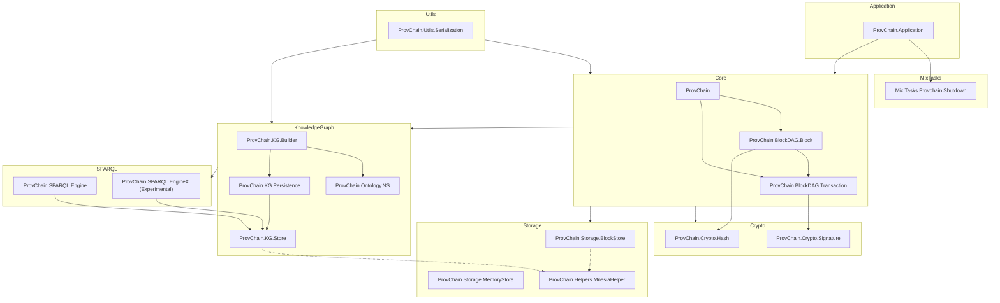

```mermaid
flowchart TD
    subgraph Application
        App["ProvChain.Application"]
    end

    subgraph Core
        ProvChain["ProvChain"]
        Block["ProvChain.BlockDAG.Block"]
        Transaction["ProvChain.BlockDAG.Transaction"]
    end

    subgraph Crypto
        CryptoHash["ProvChain.Crypto.Hash"]
        CryptoSig["ProvChain.Crypto.Signature"]
    end

    subgraph KnowledgeGraph
        direction LR
        KGBuilder["ProvChain.KG.Builder"]
        KGPersistence["ProvChain.KG.Persistence"]
        KGStore["ProvChain.KG.Store"]
        OntologyNS["ProvChain.Ontology.NS"]
    end

    subgraph SPARQL
        direction LR
        SPARQLEngine["ProvChain.SPARQL.Engine"]
        SPARQLEngineX["ProvChain.SPARQL.EngineX (Experimental)"]
    end

    subgraph Storage
        direction LR
        BlockStore["ProvChain.Storage.BlockStore"]
        MemoryStore["ProvChain.Storage.MemoryStore"]
        MnesiaHelper["ProvChain.Helpers.MnesiaHelper"]
    end

    subgraph Utils
        Serialization["ProvChain.Utils.Serialization"]
    end

    subgraph MixTasks
        MixShutdown["Mix.Tasks.Provchain.Shutdown"]
    end

    App --> Core
    Core --> Crypto
    Core --> KnowledgeGraph
    Core --> Storage

    KnowledgeGraph --> SPARQL
    KGStore -.-> MnesiaHelper
    BlockStore -.-> MnesiaHelper

    SPARQLEngine --> KGStore
    SPARQLEngineX --> KGStore


    ProvChain --> Block
    ProvChain --> Transaction
    Block --> Transaction
    Block --> CryptoHash
    Transaction --> CryptoSig

    KGBuilder --> OntologyNS
    KGBuilder --> KGPersistence
    KGPersistence --> KGStore

    App --> MixShutdown
    Utils --> Core
    Utils --> KnowledgeGraph
```
